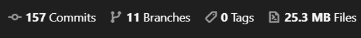
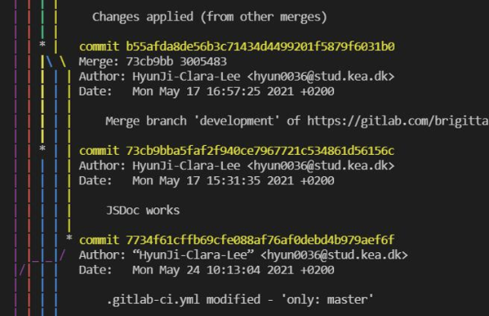
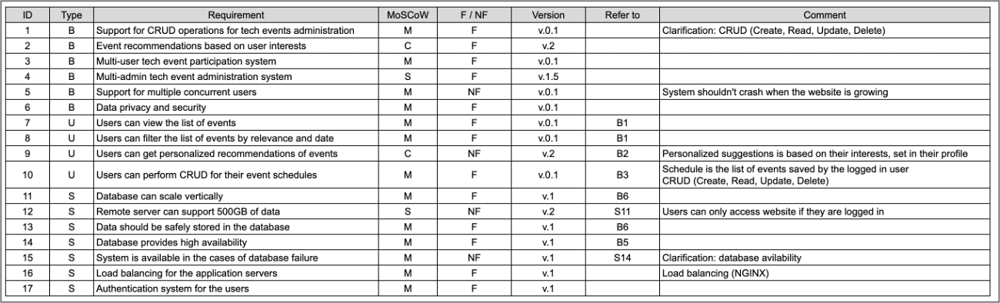
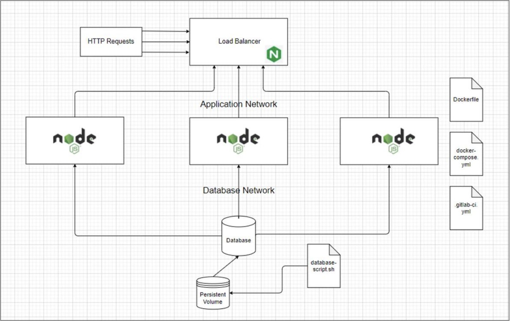

<link rel="stylesheet" type="text/css" media="all" href="styles.css" />


# Development Environment Final Project Report
**Instructors**: Henrik Strøm, Steve Albury

**Group**: Brigitta-Roberta Rucz, Michell Aagaard Dranig, Hyun Ji Lee

**GitLab Repository Link**: https://gitlab.com/brigittarucz/examApp 

**GitLab Pages Link**: https://brigittarucz.gitlab.io/examApp

**Date**: June 2, 2021


## Table of Contents
1. [Introduction](#introduction)
2. [Requirement Specifications](#requirement) 
3. [Containerization](#container) 
4. [Software Quality Assurance](#softQA)
    1. [Coding Standard](#softQAcode) 
    2. [Relevancy of Tests](#softQArelevancy) 
    3. [Testing and Converage Measurements](#softQAtesting) 
    4. [Linting](#softQAlinting) 
    5. [CI/CD](#softQAcicd) 
    6. [GitLab Pages](#softQApages) 
    7. [Documentation](#softQAdocument) 
5. [Version Control System](#version) 
6. [Database System](#database) 
7. [Operating System Components](#os) 
8. [Bibliography](#biblio) 
9. [Appendices](#append) 
    1. [Appendix A: Requirement Specifications Screenshot](#append1) 
    2. [Appendix B: Project Structure Diagram](#append2) 


## <a name="introduction"> Introduction
We live in a world where online communication has never been more important - especially after the pandemic hit the world last year. The coding world has been using various platforms to communicate and organize teamwork online for years. Previously, most people could still talk to their co-workers face to face about possible issues. Unfortunately, that was not our case, and developing this project has shown us how important it is to know how to communicate virtually. And all the tools we have used helped us develop a product that is runnable and maintainable for different people in different environments.

During this semester, we have covered ways to test, document, and deploy our code easier, altogether with properly sharing it among us through a version control system while ensuring it lives up to the industry standards. For the final exam we chose the project developed by one of the team members and started improving the code quality, reduced error frequency, and, along the way, its maintainability. This report will explain all our choices and decisions by giving a clear overview of why we proceeded in a certain way and how it improved the application.


## <a name="requirement"> Requirement Specifications
The requirement specification is a document where one can write down all the requirements for the project from several perspectives. The benefit of it is that it offers an overview of the structure of the project.

For larger projects, there are specific standards to follow when thinking about requirement specifications. However, in our project which is merely a simplistic application implementing basic CRUD operations, we did not exercise them to that extent. We have still used the tool to our benefit. In our case, we have created a spreadsheet  where we wrote down different sets of requirements based on three different sides: the business, users, and system.

All the requirements have an ID that we can refer to throughout the spreadsheet to record which requirements need what functionalities. We also have a column that states whether it is a functional or non-functional requirement. When creating a website, all functionalities are usually not included in the first release. Therefore, we have a column for MoSCoW to state if the requirement is a must, should, could, or will not. Lastly, a version number is given for each requirement based on the MoSCoW.

To ensure that we covered everything, we looked at the project from a business perspective first. This is because the business clients are usually the ones who decide the fate of the deliverable and only afterwards give to us, the developers, their wishes and needs for a project. Almost all business requirements are referenced in user requirements, system requirements, or both to meet the requirements of the business. One example is the business requirement ID #2. It states that the company wants the website to recommend events to the users based on their interests.  From a user perspective, they would not want recommendations that are unrelated to them. Therefore, we added the user requirement ID #9 to specify that users would prefer personalized, relatable recommendations.

Lastly, we have a comment column where we write down small notes or further explanations of how the requirement could be fulfilled. Using the example above, we wrote that the personalized suggestions should be based on the interests set on the user's profile.


## <a name="container"> Containerization
Docker and its characteristic of process isolation accompany a myriad of benefits compared to a VM environment. VMs run an OS on top of which all the other’s system processes need to run, which can be consuming when it comes to RAM and CPU. [1] Containers, however, share only the host OS, providing OS virtualization, which is known as containerization. [2]

In a business setting, containers improve the workflows through reduced human resources, hardware costs and provide enhanced security through a modular architecture, which allows adding or replacing any module without this interfering with the rest of the system. [2] However, it is important to mention that there are also downsides to it. In the areas such as shared resources, it can potentially lead to application interference or crashing. In terms of safety, isolation is not guaranteed, and with security, good practice suggests that no data should be stored inside them. [2]

We have practiced containerization through a NodeJS based application connected to an SQL database, specifically MariaDB.  As a workflow, the start was carved by creating a Dockerfile to allow spinning up the application in a compact Linux distribution, Alpine, with Node 15.11.0 installed. Then, instructions are being executed, out of which FROM has a high relevance and is used to set the base image. Afterward CMD, at the end of the file, specifies the command to run within the container corresponding to the very same script used in package.json to run the application.

In the terminal, the command docker build -t node-app . builds the image tagging it (-t) after which docker run -d -p 3000:3000 node-app creates the container with the specified image running it as a process (-d) binding the port 3000 of the container to the port 3000 of the host machine (-p). In this way, testing to see if the Dockerfile successfully fulfills its scope is executed.

Further, we proceed with pulling and running MariaDB and testing the connectivity between the application layer and the database layer in containers. This requires modifying the database configurations in the NodeJS files accordingly. Once successful, NGINX is added to the mix which will act as a web server, a reverse proxy, and a load balancer, all at once. To dig a bit deeper into the terms, the web server will retrieve the HTTP requests forwarding them to the application by acting as a reverse proxy, routing these further by never revealing the original IP address to the client, enhancing security. Simultaneously, the property of load balancing protects the servers from crashing due to increased traffic. [3]

In terms of implementation, it is done via making use of another Dockerfile again. In the Dockerfile, the base image is set following the COPY instruction to provide the necessary initial configurations. The utilized core context of the default.conf file is the server that defines a virtual server in itself that handles requests. The requests contain two directives: listen to set the IP address the server should respond to and server_name. [4] The location is another context worth mentioning that further divides the request handling, this time by URL routes, in our case simply /. One level deeper into the block of code, the proxy_pass directive ensures passing the request to a proxied server, while the upstream context defines a pool of servers that can be used.

Naturally, once each command has proven to run the containers linked to each other successfully and independently, we can tackle Docker Compose, a tool for “running multi-container” applications. [5] One of the most notable benefits of this technology is that other developers can easily contribute to the project, by simply running a command rather than manually configuring the whole environment needed. To set this up, the docker-compose.yml placed at the root of the project must be written. This file cumulates our efforts, defining the version number which sets the format in which the code ought to be written first. [6]

MariaDB, as a service, utilizes container_name for the database configuration in the application to match the host. Its image is pulled from the Docker Hub. We preserve data through persistent volumes managed by Docker. Moreover, the env_file sets the environment variables from a file because in this way the file could potentially be excluded from the preferred version control, protecting sensitive information. The mysqld --init-file="/tmp/database/install_db.sql" command creates the database and the tables, provided that they do not exist, populating them on the same reasoning.

The NodeJS application, as a service, builds itself from the Dockerfile previously tested. The deploy directive specifies its deployment as a running service with three replicas, handled by the load balancer, as well as a restart_policy for when the containers exit with three attempts to revive on failure. The depends_on expresses the dependency between the application and the database and sets the dependency order, the services starting one by one, being guided by it.

Nginx, as a service, similarly builds itself from the Dockerfile, sets its dependencies, and exposes port 80 for outside requests. The division of the services in networks is done through a bridge driver, providing out-of-the-box DNS resolution, meaning if they do not belong to the same default network, they cannot access each other’s IP addresses. [7] This, in return, contributes to security.


## <a name="softQA"> Software Quality Assurance
### <a name="softQAcode"> Coding Standard
The coding standard is a collection of guidelines, agreed between developers, related to the programming style, techniques and procedures used throughout the development of the software, focused on a specific programming language. [8]

In a collaborative project, developers must establish a coding standard and conform to improve code readability, consistency, reusability, and maintenance. By ensuring that the source code is readable and understandable, other team members can easily get involved and contribute. Moreover, the software is subject to security vulnerabilities if it is inconsistent, has bugs, or has logical problems. [9] These issues are usually caused by defective programming codes that may arise as a result of poor coding practices. Faulty codes also negatively affect the site’s performance, in fields such as server response, code reusability, and user interaction. Lastly, following the coding standard is cost-effective. Clean and neat code helps developers to find bugs and errors comparatively easily. [10] During the initial stage of our project, for example, members used different code formatters and Visual Studio Code would highlight all the format changes as code changes. This made it extremely difficult to differentiate important code changes from format updates.

There are some tools that assist developers with the coding standard. For our project, we are using a Visual Studio Code extension called ‘Prettier’. It is a code formatter that helps with rules such as indentation and white space. As a group of developers with different coding backgrounds and different development environments, we chose the ‘Prettier’ formatter to establish code format rules and enforce consistent code style. It is also a useful tool as it is fully automated and updates code format whenever the file is saved.

For the rest of the standards, we followed the general coding conventions for the JavaScript programming language. [11] Some of the examples includes below:
 
- Use ‘===’ instead of ‘==’ as a comparison operator: The former prevents comparisons between different types.
- Use semicolons (;): Even though it is optional in JavaScript, it is recommended to use semicolons for code consistency and clearer statement separation.
- Use ES6 arrow functions: Arrow functions are neater and more concise.
- Naming convention: Use camel case for variable and function names.

Lastly, for the file organization, we are following the Model-View-Controller pattern. The Model component is designated for the data structure, while the View component is responsible for displaying the data. Between the view and the model lies the Controller component. It listens for any events triggered by the view component and responds appropriately. [12] We have two model components in our project: event and user. These classes define how the data should be structured. Other components related to views and controllers are also put in the folder, respectively.


### <a name="softQArelevancy"> Relevancy of Tests
Code testing is highly relevant in any software deliverable because it enhances the developer’s ability to track down bugs and simultaneously mitigate their occurrence. Moreover, testing heightens one’s focus when writing code regarding parameters, code functionality, possible errors, and such, which, in return, builds better, more efficient code. Concerning the deployment, it becomes less painful, and the last-minute bugs are easily detected.

There is a myriad of testing types out of which we can highlight unit, integration, regression, and end-to-end testing, each with their particularities. [13] These can differ in scope, as in verifying the code’s logic vs. the application’s behavior in certain simulated circumstances, in scale, as in units of code vs. the full flow of the project and external interactions, as in HTTP calls or services communications.

For the NodeJS project, we have implemented both unit and integration testing through Mocha, Chai, and Docker. Mocha is a library used in conjunction with Chai, providing in this way the path for creating test suites. The first distinguishes itself through providing keywords like describe and it to describe the test’s scope and then define the block of code that is meant to be executed. [14] Tests are based on assertions which “encapsulate the logic specified about a target under test” and by either failing or succeeding they dictate the test’s result. [15]

The best practice is to describe the test at least two levels deep: what is being tested, in which scenario, and the expectations regarding the result. [16] Also, Docker was used for integration testing to avoid polluting the production database. When the scope of the test was oriented towards code dependent on data but not directly engaging with the database, substitute objects of data were provided directly in the code files to speed up the process and protect the test’s integrity.

When it comes to the relevancy of the tests, we have to ask ourselves about the most important chunks of code that keep our application alive while having in mind the requirements specification. Related to business logic, authentication is one of the crucial elements making up the application. Both page flow and routing can be tested under the umbrella involving the information exchange between the database layer and the presentation layer. Regarding this exchange, data flows through methods in the models for the user and the event so these, combined with targeted queries, could serve as a starting point for the integration testing. Lastly, what the user sees is sanitized data so the utility methods should also have their fair share of attention in the testing workflow.


### <a name="softQAtesting"> Testing and Converage Measurements
To prepare the playground for testing, we have installed Mocha and Chai as development dependencies alongside with ESLint, a technology that helps by identifying stylistic errors and hence, improving code quality. In conjunction with the ESLint tool, InstanbulJS serves as a coverage measuring tool for code testing. 

The execution involved considering the folder structure to ensure a clear separation of concerns, hence the test and integration folders hold our files for testing and a secondary MariaDB deployment through Docker. The package.json sets the configurations for InstanbulJS with code coverage for branches. Lines and statements are set to 10, the value which is currently not aligned with the best practice that employs as a reasonable goal 70-80% coverage as a minimum acceptance criterion. [17]

```json
"nyc": {
    "all": true,
    "branches": 10,
    "lines": 10,
    "statements": 10,
    "exclude": [
        "**/*window-location.js",
        "**/*coverage"
        ]
},
```

The script for running the test involves the reporters, html and text, for outputting the results, while checking the coverage is done through nyc by setting it to true, which yields the analysis’ result in the terminal.

```json
"test": "nyc --reporter=html --reporter=text --check-coverage=true mocha",
```

Diving deeper into the test files, business.spec.js handles the business logic with the chaiHttp library added to harness the true potential of integration testing and make requests to the application routes. The tests target the GET method involving both /dashboard and /profile routes with and without authentication. This is executed by setting the local storage session ID with a user ID corresponding to an entry in the database. The POST method in authentication verifies sign-up, while the 404 error is ensured to be thrown with passing the /incorrect route and checking the result status.

The integration.spec.js file includes the test database which replicates the data and targets core methods involving user handlings, such as fetching the user by email, by ID or creating a new user, email handling, with fetching all the events and database queries for retrieving the user by email and the event by title. The expect directive belongs to one of the assertion styles that Chai provides, along with other flavors such as should. When speaking about containerization, the Dockerfile pulls the MariaDB image from the Docker Hub, setting the environment variables and running the init_db.sql file to populate it with data. Port 3308 is exposed to avoid clashing with port 3306 used by the application. The initialization script creates the techevents_users.users and techevents_users.events tables, and INSERT IGNORE ensures that the process will not crash in the case of the data having been already inserted.  

Lastly, sanitization.spec.js tests the utility methods through already defined data objects for the events and the user. It focuses on the recommendation algorithm retrieval by assigning the user object different professions which calculate through the formatSimilarity method the event count for suitable suggestions. Moreover, the sanitization of the price in the presentation layer occurs through test cases involving different data variants which can be contained by the attendance_price property of the event.


### <a name="softQAlinting"> Linting
Linting is the process of testing your source code for syntactic and stylistic problems using an automated system. A lint tool, also called a linter, performs static code analysis, meaning it analyzes the source code without running the application. A linter can help enforce coding standards. It also helps reduce cost because a linter may detect bugs and errors before deployment. [18]

ESLint is one of several lint tools available for JavaScript. ESLint is a relatively new and widely used tool for linting JavaScript code. It is built to be readily expandable and includes many plugins. It is also known for having the finest ES6 support and for being the only linter that works with JSX. [19] We opted to utilize ESLint as our linting tool for the project based on our research. We use the env: {"node": true} option in the .eslintrc.json file to allow the linter to recognize that the project is built using the Node environment. Moreover, because Mocha and Chai syntaxes are unrecognized by the linter and flags errors, we generated a file named .eslintignore to exclude the test directory.

As a rule, ESlint ensures that global variables are read-only, meaning that you should not change that variable. This rule is called no-global-assign. We do, however, change the localStorage to save the user ID, which, of course, throws errors. To fix this, we changed the .eslintrc.json file to state that the global variable localStorage should also be a writable: 

```json
"globals": {
    "localStorage": "writable"
},
```

Another issue we came across was the four presumably unused functions in our JavaScript code. Even though the functions were being called in the files with the .html and .ejs extension, the linter was skipping those files and threw errors. This is because the linter was built to check only .js extensions. We tried several of the linter plugins, but these were only for recognizing HTML or Ejs syntaxes in other file types. To avoid omitting the whole folder public and not linting the JavaScript code in here, we added a line before each of the functions, telling the linter to disable the check for no-unused-vars on the next line: 

```javascript
// eslint-disable-next-line no-unused-vars
function animateLogin() {
```


### <a name="softQAcicd"> CI/CD
The CI/CD pipeline involves a series of automated processes, for our specific case, testing, coverage, and linting, which are integrated with the version control. In this way, with frequent committing, the integration allows for consistency and quality, ensuring through the tools previously listed that the code is up to the standards.

To clarify, continuous integration implies that the developers are constantly integrating their code with the main branch, enhancing collaborative work and keeping away from time-wasting activities that would result from excessive individual labor. In this step, several safety pillars in the form of automated processes ensure code quality. Continuous delivery gets into play afterward, implying that the team has put in place an automated way of deploying and delivering the systems in a dedicated infrastructure. Hence, due to its highly collaborative nature and focus on software rather than documentation, CI/CD itself is part of the agile methodology. [20]

When it comes to implementation, many paths initially seemed plausible. However, in the end, through trial and error, there was only one viable solution left. Starting with package.json, this holds the scripts to run in the .gitlab-ci.yml file for testing locally in its full glory, coverage with partial testing and linting. One might wonder why testing is split. Given that we are using two different databases for testing, the production one and a replica, we found ourselves facing a difficult issue: how to run standalone databases in the pipeline’s environment? Hence there were a few unsuccessful attempts which are as it follows:

- Using a registry Dockerfile integrating the Docker Hub image of the full-blown environment created through docker-compose for the application. Issues arose:
    - port clashing between the npm test command and the application solved through pushing another Docker Hub image without CMD ["npm", "start"] in the Dockerfile;
    - exiting container later on prevented through  ENTRYPOINT ["tail", "-f", "/dev/null"] added in the registry Dockerfile;
    - database connection in a closed state when running the tests.
- Services in .gitlab-ci.yml file.


```json
"test": "nyc --reporter=text-summary --check-coverage=true mocha --exit > coverage.txt",
"coverage": "nyc --reporter=text-summary mocha ./test/sanitization.spec.js --exit",
"lint": "eslint .",
```

Following these, we have restricted ourselves to running database-independent tests through npm run coverage. Locally, npm test outputs the tests with their failing or succeeding status, as well as code coverage measuring for statements, branches, functions, and lines in coverage.txt. The registry Dockerfile now simply contains the application with Node installed in an Alpine-based environment.

The .gitlab-ci.yml file uses the registry image and caches the node_modules/ so that the project’s dependencies do not have to be fetched multiple times. Stages are defined, of relevance to this section: build which installs the aforementioned dependencies and test which runs the commands npm run coverage and npm run lint, preventing the pipeline from succeeding on failure. 


### <a name="softQApages"> GitLab Pages
When using GitLab, developers can generate static websites using GitLab pages. There are multiple Static Site Generators (SSG) such as Jekyll, Hugo, and Hexo. Because our project is built with NodeJS, however, there are a few difficulties in generating a static website out of our project. Therefore, we decided to use the static GitLab pages as an introduction to our project report. In terms of SSG, we use Jekyll.

```javascript
pages:
    image: registry.gitlab.com/kea-teachers/kea-development-environments-2021-1
    stage: deploy
    script:
        - cd ./pages
        - bundle exec Jekyll build -d ../public/
    artifacts:
        paths:
            - public
    only:
        - master
```

To utilize the GitLab Pages, we included a stage named deploy in our .gitlab-ci.yml file. The YML file describes how a Runner should construct the static website. With the instructor’s permission, we are using the registry image built from the instructor’s course material repository. We are running two scripts in this stage: cd ./pages and bundle exec Jekyll build -d ../public/. When the pipeline is running, the Runner will move into a directory named .pages and execute the static site generator called Jekyll. With the build directive, we are using the -d flag to specify the build environment (directory). In the above example, we are building the static website at a directory called public on the parent level of the pages directory. Then, we provide a path to the public directory as a path to the artifacts of the website which will be uploaded to GitLab. Lastly, the only directive specifies that the job will be running only when the code is pushed into the master branch. This is to ensure that only when the development is completed and the modified code is deployed and pushed to the master branch, the website will also be updated accordingly. 

Other than the codes in the .gitlab-ci.yml  file, we also created two new files: Gemfile and Gemfile.lock, following the examples from the instructor’s repository. The former file ensures consistent Jekyll and gem version – it describes the versions and the dependencies for the Ruby program. The latter records more detailed versions installed. [21]


### <a name="softQAdocument"> Documentation
Documentation in software development is a written piece of text or a graphical element that describes the source code. [22] It explains how the program works or how to operate it. The purpose of the documentation is to easily keep track of different modifications on different parts of an application so that developers can maintain code and transfer knowledge fluently and seamlessly. Good documentation is where it assists newcomers with learning the product, reduces support cost, and allows information to be easily accessible. In our project, we created two types of documentation: user documentation and developer documentation. [23]
 
User documentation is a manual primarily written for end-users and system administrators who handle the product. It includes information such as installation, usage guide, and troubleshooting. [24] With the target audience in mind, we provide brief information of technologies used, application features, and example screenshots of the website in our README.md file.
 
For the developer documentation, we are using a markup language called JSDoc to generate it, being the go-to for a JavaScript-based project. [25] As the below example shows, the information involving scope, arguments, and description is placed inside the comment that starts with /** and ends with */. The details within those comments will be detected by the JSDoc parser, which will, in return, generate the documentation automatically. The tags, such as @constructor and @param describes more specific information for components such as functions and classes. Once the project is updated with comments, we run the jsdoc {file_name} command to auto-generate HTML documentation files. [26] 

```javascript
/** 
 * User class* @class This is a User class representing a user of the website.
 */
module.exports = class User {

/**
  * Create a user.
  * @param {string} id - The id of the user randomly generated by UUID npm library.
  * @param {string} email - The email of the user.
  * @param {string} password - The password of the user account.
  * @param {string} profession - The profession of the user.
  * @param {number} experience - The number of years of user's job experience.
  * @param {string} interests - The subjects of user's interests.
  * @param {string} events - The event(s) the user saved on their account.
  */
```

The auto-generated outputs of the JSDoc can be found inside the out directory of the project.


## <a name="version"> Version Control System
Version control is the process of monitoring and handling modifications to software code. A version control system is a tool that aids software development teams in managing and tracking source code updates. For high-performing applications and DevOps departments, using version management software is a best practice. Version management also lets developers work more quickly and encourages development projects to maintain productivity and agility as the team grows. [27] 
 
In our project, we implement the Git Feature Branch Workflow. Theoretically, any developing features should be done on a dedicated branch instead of working directly on the master branch. This is to encapsulate and protect the code base and to ensure the main branch will not contain broken code. Moreover, it also forces developers to create a pull request each time they complete a feature and would like to merge it to the code base where other developers on the team can check, approve, and discuss the feature. [28] However, because the web application code was completed before the project started, we have not created a separate feature branch for developing the web application.
 
For the rest of the project development, including features such as dockerization and software quality assurance, we created a branch called development. As a standard, the members agreed upon creating a new branch every time a member works on a feature. Once the feature is completed, the member creates a pull request to the development branch, not the master branch. In this way, we ensured that we share our work and only push approved working codes into the main branch.






## <a name="database"> Database System
Choosing a database is one of the most crucial parts when developing a website. The database paradigm has to match the needs of the application. In our case, we have a website where users can see events and add them to their own schedule so they can have a clear overview of what they are participating in.

Looking at our requirement specifications from a business point of view, we want to be able to have a high number of users who can add and save events to their personal schedule. With this requirement, it is important to have a database that can handle a large number of interactions simultaneously. Another requirement for this website is that users should be able to browse events, comment, and manage their schedules. This implies that a lot of data will be intertwined throughout the website. Since we will be having a lot of relational data it makes sense to pick a Relational Database Management System, RDBMS.
 
There are plenty of advantages when picking this type of database for our case. A relational database follows the ACID model, which creates a reliable system. ACID stands for Atomic, Consistent, Isolated, and Durable. [29] When each of those properties come together, all transactions and actions on the website will happen only when all parts of the actions are complete. Nothing will be sent to the database unless all required fields are filled out, and the connection to the database is a success. If a crash happens to the server and the connection to the database is cut off, it will roll back and not save anything.

Another important aspect belonging to the ACID principles is that everything happens in isolation. Multiple users can perform updates to their profile since each user is assigned a row in the database and will only manipulate that assigned row. So, if another user starts updating their profile, they will only be manipulating their row and no one else’s. At the same time, no user has to wait until another user is done to be able to edit their profile.

Even though our database choice seemed “cut and dry”, there are still downsides to using a relational database. For larger companies that store an endless amount of data, it might be an expensive choice of the database since it scales vertically, meaning it needs much more RAM and CPU power to be able to store all the data. Another downside can be the rigid schema. All tables should be normalized so they do not have any empty cells nor repeated data. Whenever you delete data, it should cascade throughout the website as well. This is where NoSQL databases come in. NoSQL means “not only SQL”. It is a wide term covering database paradigms such as key/value, document, or graph-based databases. NoSQL databases have a much more relaxed schema for those who want to be more flexible with their data. Another advantage for NoSQL databases is that they scale horizontally, which means you can have the database running on many servers. This is much cheaper compared to vertical scaling.
 
Where the RDBMS is ACID compliant, NoSQL databases are BASE compliant. The BASE stands for Basic Availability, Soft-state, and Eventual Consistency. These all contribute to the relaxed schema where the database isn’t necessarily consistent, but it is always available through at least one server.
Many larger companies can benefit from using multiple database systems for individual tasks, but a sage choice is always to use a relational database since it provides the biggest safety net. [30] Because of the transactions in a relational database, you will never have any data stored that does not belong and if something goes wrong, you’ll be sure it doesn’t go to the database.
 
By taking the benefit of speed and horizontal scaling of NoSQL into consideration, one can conclude it doesn’t overshadow the advantages of the reliable schema and the ACID properties of a relational database. Since we know how we want to store our data and how they are inter-connected to each other, a relational database is the best choice for the project.


## <a name="os"> Operating System Components
An operating system (OS) is software that manages and controls resources while also providing common functions to computer programs. [31] The operating system provides software applications with application programming interfaces (APIs) for memory allocation, input/output (I/O) operations, and other tasks.
 
UNIX is a computer operating system created by a group of AT&T Bell Labs workers, notably Ken Thompson, in 1969. Today, the name Unix refers to any operating system that follows UNIX standards, which means that the core operating system works in the same way as the original UNIX system. [32] A Unix operating system, also called UNIX-like operating system, behaves like a UNIX system but does not have to comply with or be certified to any version of the Single UNIX Specification. [33]
 
In our project, we are using Unix (UNIX-like) operating systems: Linux-based system and macOS. Both Linux-based systems and macOS fall under the umbrella of Unix systems – much of their core design is based on UNIX.
 
The member who currently uses a Windows machine for the project has integrated the Windows Subsystem for Linux to leverage the full potential of Linux and generate an environment that would painlessly allow following the course as a Windows user. This comes with many advantages: allowing Docker to run without needing to maintain additional Windows scripts, altogether improving the boot time of the Docker daemon, and allowing faster building containers due to WSL’s dynamic memory allocation. [34] She has installed her Linux flavor of choice from the Microsoft store – Ubuntu and configured the WSL integrations from the GUI to enable additional distros, specifically Ubuntu-20.04. [35] Moreover, to effortlessly navigate the code through using the GUI offered by VSC instead of the terminal, she needed to install the Remote – WSL extension allowing her to use the code editor from Linux as she would normally use it from Windows. [36]
 
In terms of macOS, two members had to install Docker GUI to utilize the Docker systems. In order to start and run the Docker containers, the members had to initiate the Docker application and manage the containers either through the graphical interface of the application or the command line interface on the Visual Studio Code application. Besides the Docker application installation, the macOS did not require any further operating system components to develop and implement the project.


## <a name="biblio"> Bibliography
[1] 	R. Bauer, "What’s the Diff: VMs vs Containers," BACKBLAZE, 28 June 2018. [Online]. Available: https://www.backblaze.com/blog/vm-vs-containers/. [Accessed 20 May 2021].

[2] 	D. Firesmith, "Virtualization via Containers," Carnegie Mellon University, 25 September 2017. [Online]. Available: https://insights.sei.cmu.edu/blog/virtualization-via-containers/. [Accessed May 2021].

[3] 	Ashwin, "NGINX with Docker and Node.js — a Beginner’s guide," Medium, 29 October 2020. [Online]. Available: https://ashwin9798.medium.com/nginx-with-docker-and-node-js-a-beginners-guide-434fe1216b6b. [Accessed May 2021].

[4] 	J. Ellingwood, "Understanding the Nginx Configuration File Structure and Configuration Contexts," Community, 19 November 2014. [Online]. Available: https://www.digitalocean.com/community/tutorials/understanding-the-nginx-configuration-file-structure-and-configuration-contexts. [Accessed May 2021].

[5] 	Docker, "Overview of Docker Compose," Docker, [Online]. Available: https://docs.docker.com/compose/. [Accessed May 2021].

[6] 	Docker, "Compose file version 3 reference," Docker, [Online]. Available: https://docs.docker.com/compose/compose-file/compose-file-v3/. [Accessed May 2021].

[7] 	Docker, "Use bridge networks," Docker , [Online]. Available: https://docs.docker.com/network/bridge/. [Accessed May 2021].

[8] 	Wikipedia, "Coding Conventions," Wikipedia, [Online]. Available: https://en.wikipedia.org/wiki/Coding_conventions. [Accessed May 2021].

[9] 	Multidots, "Importance of Code Quality and Coding Standard in Software Development," Multidots, 21 January 2020. [Online]. Available: https://www.multidots.com/importance-of-code-quality-and-coding-standard-in-software-development/. [Accessed May 2021].

[10] 	K. Beladiya, "Importance of Code Quality and Coding Standard in Software Development," The One, 21 January 2020. [Online]. Available: https://theonetechnologies.com/blog/post/importance-of-code-quality-and-coding-standard-in-software-development. [Accessed May 2021].

[11] 	D. Anderson, "19 simple JavaScript coding standards to keep your code clean," JavaScript, 08 June 2020. [Online]. Available: https://javascript.plainenglish.io/19-simple-javascript-coding-standards-to-keep-your-code-clean-7422d6f9bc0. [Accessed May 2021].

[12] 	Wikipedia, "Model–view–controller," Wikipedia, [Online]. Available: https://en.wikipedia.org/wiki/Model%E2%80%93view%E2%80%93controller. [Accessed May 2021].

[13] 	LogRocket, "Unit and integration testing for Node.js apps," LogRocket, 12 November 2019. [Online]. Available: https://blog.logrocket.com/unit-and-integration-testing-for-node-js-apps/. [Accessed May 2021].

[14] 	Code Academy, "Introduction to Testing with Mocha and Chai," Code Academy, [Online]. Available: https://www.codecademy.com/articles/bapi-testing-intro. [Accessed May 2021].

[15] 	Wikepedia, "Test assertion," Wikepedia, [Online]. Available: https://en.wikipedia.org/wiki/Test_assertion. [Accessed May 2021].

[16] 	Y. Goldberg, "javascript-testing-best-practices," MIT, May 2021. [Online]. Available: https://github.com/goldbergyoni/javascript-testing-best-practices/. [Accessed May 2021].

[17] 	S. Cornett, "Minimum Acceptable Code Coverage," Bullseye Testing Technology, [Online]. Available: https://www.bullseye.com/minimum.html. [Accessed May 2021].

[18] 	Section, "Linting in Node.js using ESLint," Section, 24 August 2020. [Online]. Available: https://www.section.io/engineering-education/node-eslint/. [Accessed May 2021].

[19] 	J. Hartikainen, "A Comparison of JavaScript Linting Tools," sitepoint, 05 March 2015. [Online]. Available: https://www.sitepoint.com/comparison-javascript-linting-tools/. [Accessed May 2021].

[20] 	I. Sacolick, "What is CI/CD? Continuous integration and continuous delivery explained," InfoWorld, 17 January 2020. [Online]. Available: https://www.infoworld.com/article/3271126/what-is-cicd-continuous-integration-and-continuous-delivery-explained.html. [Accessed May 2021].

[21] 	Jekyll, "Step by Step Tutorial 10. Deployment," Jekyll, [Online]. Available: https://jekyllrb.com/docs/step-by-step/10-deployment/. [Accessed May 2021].

[22] 	Wikipedia, "Software Documentation," Wikipedia, [Online]. Available: https://en.wikipedia.org/wiki/Software_documentation. [Accessed May 2021].

[23] 	A. Trica, "The Importance of Documentation in Software Development," filtered, 18 September 2010. [Online]. Available: https://filtered.com/blog/post/project-management/the-importance-of-documentation-in-software-development. [Accessed May 2021].

[24] 	altexsoft, "Technical Documentation in Software Development: Types, Best Practices, and Tools," altexsoft, 01 December 2020. [Online]. Available: https://www.altexsoft.com/blog/business/technical-documentation-in-software-development-types-best-practices-and-tools/. [Accessed May 2021].

[25] 	Go Make Things, "What's the best way to document JavaScript?," Go Make Things, 20 August 2018. [Online]. Available: https://gomakethings.com/whats-the-best-way-to-document-javascript/. [Accessed May 2021].

[26] 	JSDoc, "Getting Started with JSDoc 3," JSDoc, [Online]. Available: https://jsdoc.app/about-getting-started.html. [Accessed May 2021].

[27] 	ATLASSIAN, "What is version control?," ATLASSIAN, [Online]. Available: https://www.atlassian.com/git/tutorials/what-is-version-control#benefits-of-version-control. [Accessed May 2021].

[28] 	ATLASSIAN, "Git Feature Branch Workflow," https://www.atlassian.com/git/tutorials/comparing-workflows/feature-branch-workflow, [Online]. Available: https://www.atlassian.com/git/tutorials/comparing-workflows/feature-branch-workflow. [Accessed May 2021].

[29] 	IBM, "ACID properties of transactions," IBM, 02 May 2021. [Online]. Available: https://www.ibm.com/docs/en/cics-ts/5.4?topic=processing-acid-properties-transactions. [Accessed May 2021].

[30] 	Software Testing Help, "SQL Vs NoSQL Exact Differences And Know When To Use NoSQL And SQL," Software Testing Help, 27 March 2021. [Online]. Available: https://www.softwaretestinghelp.com/sql-vs-nosql/. [Accessed May 2021].

[31] 	Wikipedia, "Operating system," Wikipedia, [Online]. Available: https://en.wikipedia.org/wiki/Operating_system. [Accessed May 2021].

[32] 	Wikipedia, "Unix," Wikipedia, [Online]. Available: https://en.wikipedia.org/wiki/Unix. [Accessed May 2021].

[33] 	Wikipedia, "Unix-like," Wikipedia, [Online]. Available: https://en.wikipedia.org/wiki/Unix-like. [Accessed May 2021].

[34] 	Docker, "Docker Desktop WSL 2 backend," Docker, [Online]. Available: https://docs.docker.com/docker-for-windows/wsl/. [Accessed May 2021].

[35] 	Microsoft, "Windows Subsystem for Linux Installation Guide for Windows 10," Microsoft, 07 April 2021. [Online]. Available: https://docs.microsoft.com/en-us/windows/wsl/install-win10. [Accessed May 2021].

[36] 	M. Hernandez, "WSL 2 with Visual Studio Code," Visual Studio Code, 03 September 2019. [Online]. Available: https://code.visualstudio.com/blogs/2019/09/03/wsl2. [Accessed May 2021].


## <a name="append"> Appendices
### <a name="append1"> Appendix A: Requirement Specifications Screenshot


### <a name="append2"> Appendix B: Project Structure Diagram
